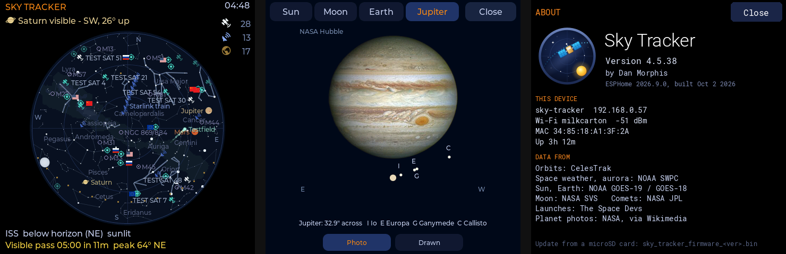
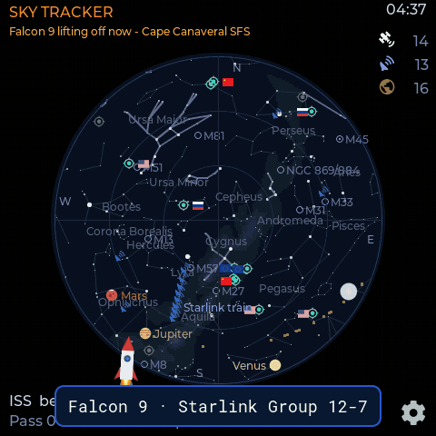

# Sky Tracker

A 4" touch screen that shows what's overhead right now: the ISS, Tiangong,
Starlink trains, a few hundred other satellites, the Sun, Moon and planets, the
stars and constellations, the Milky Way and any comet bright enough to matter.
It runs on a cheap Guition ESP32-4848S040 panel with ESPHome and does all the
orbit math on the chip. From the internet it only needs fresh orbital elements a
couple of times a day, plus a few small feeds (space weather, launches) and the
pictures you ask for.



*Screens from the desktop test build, with test data.*

## What it does

- **Sky map.** Everything above your horizon, updated every couple of seconds.
  Tap anything for details: height, speed, whether it's sunlit, when it rises
  and sets, the owner's flag for satellites.
- **Passes.** The next visible ISS pass with a countdown, and its track drawn
  across the sky when you tap the ISS.
- **Alerts.** One line under the title, rotating every minute; tap it for the
  details. Each kind has its own switch:
  - the sky: aurora (NOAA's Kp and OVATION nowcast, only after dark), planets
    and alignments, meteor showers, the full Moon and the Moon near a planet,
    eclipses, solstices and equinoxes, bright comets;
  - space weather: NOAA storm watches, geomagnetic storms, big solar flares and
    radiation storms;
  - spaceflight: visible ISS and Tiangong passes, launches, dockings and
    undockings, capsule splashdowns, and objects about to re-enter (with an
    estimate of when, and whether they pass over you first);
  - "This day in 1969: ...", a moment from space history, now and then.
- **Pictures.** Today's Sun (GOES-19 SUVI), the Moon as it looks this hour (NASA
  Dial-A-Moon), the whole Earth and your region from GOES, the University of
  Alaska's Poker Flat all-sky camera (is the aurora up right now?), and
  built-in photos of the planets. Pictures fill in from the top as they download.
- **Launches.** The next rocket launches, from The Space Devs' Launch Library,
  with RocketLaunch.Live as a backup. Ten minutes out, a full-screen countdown
  shows the mission, GO or HOLD, and whether the webcast is live. At lift-off a
  cartoon rocket flies across the screen with the mission name (tap to skip, or
  turn it off with the Launch Animation switch); ISS undockings and splashdowns
  get their own animations:

  
- **Home Assistant.** ISS overhead, next pass, aurora chance, solar wind and
  more show up as entities. Location, heading and layers can be set from HA,
  the touch screen, or the built-in web page.
- **Optional add-ons.** A GPS module sets your location for you; a GY-271
  compass board turns the map so its top points where the screen faces.

## Hardware

- [Guition ESP32-4848S040](https://devices.esphome.io/devices/guition-esp32-s3-4848s040/)
  (ESP32-S3, 8 MB PSRAM, 16 MB flash, 480x480 IPS, GT911 touch). The version
  without relays leaves the relay pins free for the compass.
- Optional GPS (ATGM336H or anything that speaks 9600-baud NMEA): GPS TX to
  GPIO42 (module pin 35), plus 3.3 V and ground.
- Optional compass (GY-271 with a QMC5883L, QMC5883P or HMC5883L): SDA to GPIO1,
  SCL to GPIO2 (the relay 3 and relay 2 pads).
- Optional microSD card in the TF slot, for installing firmware without a
  network.

## Getting it running

### Flash it

The firmware is built by GitHub Actions on every release and published at
`https://akcoder.github.io/sky-tracker/`. To build it yourself, take
[`sky-tracker.yaml`](sky-tracker.yaml) into the ESPHome Builder (it pulls the C++
from this repo on its own), plug the panel in over USB and install.

### Wi-Fi

A fresh unit doesn't know your network. Either:

- connect over USB and use [Improv](https://www.improv-wifi.com) from the
  ESPHome web tools, or
- wait 30 seconds for the **Sky Tracker - XXXX** access point to appear, join
  it from your phone and pick your network.

The screen tells you which of the two it's waiting for.

### Home Assistant

Once it's on your network, Home Assistant finds it. To take control of the
config (and set your own API key), adopt it in the ESPHome Builder; the
`dashboard_import` block points it back at this repo.

## Updates

The device checks this repo's releases every hour and asks before installing
anything. You can also check by hand from **Settings > Upgrade Check**. Home Assistant
shows the same update as a normal firmware update.

No network? Copy the release's `.ota.bin` to a microSD card as
`sky_tracker_firmware_<version>.bin` and put it in the slot. The panel offers
to install it, checks that the file really is Sky Tracker firmware for this
board, and leaves your current version in place if anything goes wrong.

## Settings

Tap the gear on the map. Five tabs: **Display** (brightness with an automatic
evening dim, a red night mode, 12/24 hour clock, miles or km, time zone),
**Location** (latitude and longitude, or GPS; map heading, or compass),
**Celestial** (stars, constellations, Milky Way, planets, comets), **Satellites**
(which layers, the low-orbit cone, trails, space stations) and **Alerts** (which
alerts you want, and the launch countdown). The same switches are on the web page
and in Home Assistant. **About** shows the version and where all the data comes
from.

## Building from source

```
sky-tracker.yaml          the device config (what the Builder and CI build)
components/sky_tracker/   the C++: orbit propagation, drawing, data download
docs/requirements.md      how every piece is supposed to behave, and why
docs/comps/               design comps and screen renders
tools/                    generators for the star catalogue, Milky Way, logo
tools/host_test/          a desktop build of the UI and the tests (./build.sh, ./t4)
```

The YAML calls into the `sat::` namespace through lambdas. The headers are
included into ESPHome's `main.cpp` by the `sky_tracker` external component;
newer features live in `sky_extra.cpp` so `main.cpp` doesn't grow any further
(see BUILD-7 in the requirements for the linker limit that forced this).

To cut a release: bump `fw_version` in `sky-tracker.yaml`, then publish a GitHub
release tagged with the same version. The workflow builds the firmware,
attaches it to the release and updates the manifest the devices read.

## Where the data comes from

| What | Source |
| --- | --- |
| Orbits, objects about to re-enter | [CelesTrak](https://celestrak.org) (SatNOGS as a fallback for the ISS) |
| Kp, solar wind, aurora nowcast, space weather alerts | [NOAA SWPC](https://www.swpc.noaa.gov) |
| Sun, Earth pictures | NOAA GOES-19 SUVI and GOES-18/19 GeoColor |
| All-sky camera | [UAF Geophysical Institute](https://allsky.gi.alaska.edu), Poker Flat Research Range |
| Moon | [NASA SVS Dial-A-Moon](https://svs.gsfc.nasa.gov/help/#apis-dialamoon) |
| Comets | [JPL Small-Body Database](https://ssd.jpl.nasa.gov) |
| Launches, dockings, splashdowns | [The Space Devs](https://thespacedevs.com) Launch Library, [RocketLaunch.Live](https://www.rocketlaunch.live) as a backup for launches |
| Planet photos | NASA, ESA (Mars: ESA Rosetta OSIRIS, CC BY-SA 3.0 IGO), via Wikimedia Commons |
| Stars, constellations, Milky Way | [d3-celestial](https://github.com/ofrohn/d3-celestial) (Hipparcos positions, BSD-3-Clause) |

All of these are free and need no API key. Please don't point a fleet of
devices at them more often than the firmware already does.

## License

GPL-3.0. See [LICENSE](LICENSE).

Made in Wasilla, Alaska by Dan Morphis.
